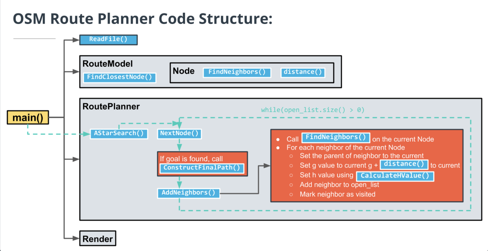
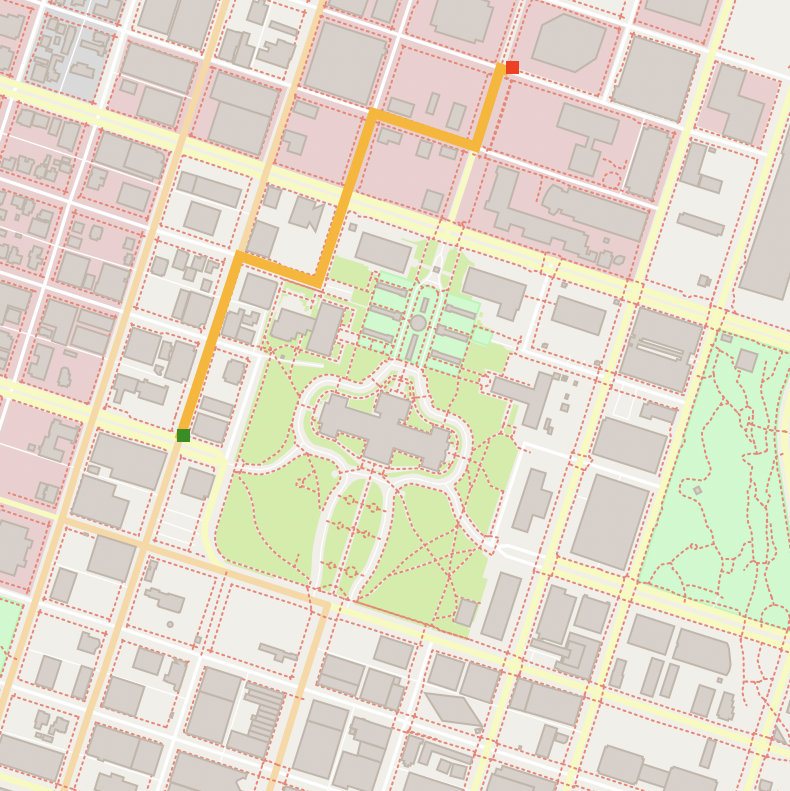

# OpenStreetMap Route Planning Project

OpenStreetMap route planning project from the [Udacity C++ Nanodegree Program](https://www.udacity.com/course/c-plus-plus-nanodegree--nd213).

## Description

Create a route planner that plots a path between two points on a map using real map data from the  [OpenStreeMap project](https://classroom.udacity.com/nanodegrees/nd213/parts/0695ba01-bd82-48df-bedb-18bb87ab3b73/modules/b92850d9-cabe-445a-af5b-bc45af228626/lessons/4c62f051-2032-4ca1-aaa9-6293e0cbe6db/concepts/285bffbf-2faa-454d-a81f-9057a270e9e9) . The path between the start and end points are found using the  search algorithm. 

## Code Structure

  

## Sample Output

  

